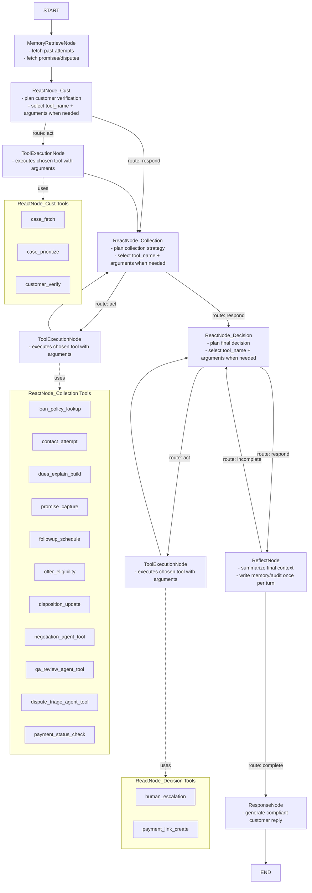

```mermaid
flowchart TD
  Start["START"] --> MR["MemoryRetrieveNode\n- fetch past attempts\n- fetch promises/disputes"]
  MR --> RN1["ReactNode_Cust\n- plan customer verification\n- select tool_name + arguments when needed"]
  RN1 -->|route: act| TE1["ToolExecutionNode\n- executes chosen tool with arguments"]
  RN1 -->|route: respond| RN2
  TE1 --> RN2
  
  RN2["ReactNode_Collection\n- plan collection strategy\n- select tool_name + arguments when needed"]
  RN2 -->|route: act| TE2["ToolExecutionNode\n- executes chosen tool with arguments"]
  RN2 -->|route: respond| RN3
  TE2 --> RN2
  
  RN3["ReactNode_Decision\n- plan final decision\n- select tool_name + arguments when needed"]
  RN3 -->|route: act| TE3["ToolExecutionNode\n- executes chosen tool with arguments"]
  RN3 -->|route: respond| RF["ReflectNode\n- summarize final context\n- write memory/audit once per turn"]
  TE3 --> RN3
  
  RF -->|route: incomplete| RN3
  RF -->|route: complete| RS["ResponseNode\n- generate compliant customer reply"]
  RS --> End["END"]

  subgraph CUST["ReactNode_Cust Tools"]
    T1["case_fetch"]
    T2["case_prioritize"]
    T4["customer_verify"]
  end

  subgraph COLLECTION["ReactNode_Collection Tools"]
    T5["loan_policy_lookup"]
    T3["contact_attempt"]
    T6["dues_explain_build"]
    T10["promise_capture"]
    T11["followup_schedule"]
    T7["offer_eligibility"]
    T12["disposition_update"]
    T14["negotiation_agent_tool"]
    T15["qa_review_agent_tool"]
    T16["dispute_triage_agent_tool"]
    T9["payment_status_check"]
  end

  subgraph DECISION["ReactNode_Decision Tools"]
    T13["human_escalation"]
    T8["payment_link_create"]
  end

  TE1 -.uses.-> CUST
  TE2 -.uses.-> COLLECTION
  TE3 -.uses.-> DECISION
```
